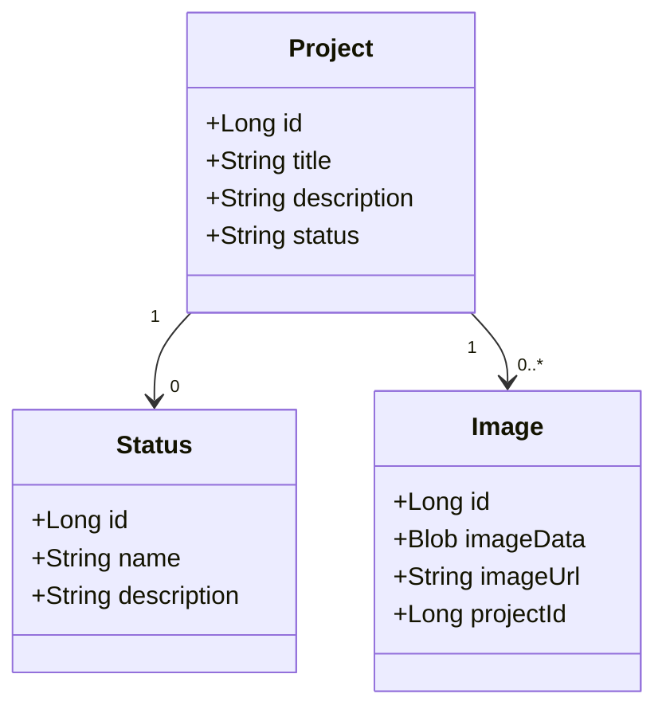

# Project Management Dashboard

A single-user project management dashboard built with Java Spring Boot backend and React frontend. The application allows an admin to manage projects and integrates with GitHub's API for commit tracking.

## 🌟 Features

### User Authentication
- Single-user (admin) login system

### Project Management
- Create and edit projects (title, description, status)
- Publish/unpublish functionality
- GitHub integration for latest commit messages
- Project image display

### Project Listing
- Structured project view
- Status-based filtering (In Progress, Completed, Published, Unpublished)

## 🛠️ Tech Stack

### Backend
- Java Spring Boot
- Spring Security
- JPA/Hibernate
- GitHub API Integration

### Frontend
- React
- React Router
- Axios
- Styled Components/Tailwind CSS

## 🚀 Future Enhancements
- Database schema implementation
- Project tagging system
- Search and filtering capabilities
- JWT authentication
- Enhanced UI animations

## ⚙️ Installation

*Installation instructions will be provided in future development phases.*

# Project Management Dashboard - Requirements

## Functional Requirements
1. The system must allow the admin to log in securely.
2. The admin must be able to create new projects with a title, description, and status.
3. The admin must be able to update project details.
4. The admin must be able to delete projects.
5. The admin must be able to set projects as published or unpublished.
6. The system must display a list of all projects.
7. The system must fetch and display the last commit message from GitHub.
8. The system must allow filtering of projects by status (e.g., In Progress, Completed, Published, Unpublished).
9. The system must allow uploading and displaying an image for each project.
10. The system must provide a responsive UI for managing projects efficiently.

## Technical Requirements
1. The backend must be built using Java Spring Boot.
2. The frontend must be developed using React.
3. The system must use PostgreSQL as the database.
4. The authentication must be implemented using Spring Security.
5. The frontend must interact with the backend using RESTful APIs.
6. The system must use JPA/Hibernate for database interactions.
7. The system must integrate with the GitHub API to fetch the latest commit messages.
8. The frontend must use React Router for navigation.
9. The UI must be styled using Styled Components or Tailwind CSS.
10. The system must be containerized using Docker for deployment.

# testing purposes
