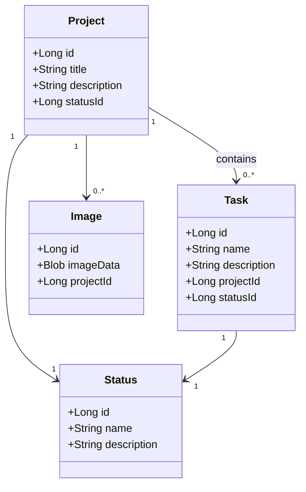

# Project Management

A single-user project management dashboard built with Java Spring Boot backend.

## Functional requirements
- The system must allow the admin to log in securely. (Try to add OAuth as well)
- The admin must be able to create new projects with a title, description, and status.
- The admin must be able to update project details.
- The admin must be able to delete projects.
- The admin must be able to set projects as published or unpublished.
- The system must display a list of all projects.
- The system must fetch and display the last commit message from GitHub/Gitlab/ bare branch. (future)
- The system must allow filtering of projects by status (e.g., In Progress, Completed, Published, Unpublished).
- The system must allow uploading and displaying an image for each project.
- This Micro-service should be agnostic for whatever it is being called by.

## Technical requirements
- Technical is not too much of an concern. Since this is a learn-by-doing project. I will however keep some standards that I learn along the way.
- So basically I'm using Java and SpringBoot
- Here in there I'm using Docker and some actions for some CI/CD pipelines.
- Later on also will be automatically adding tags. So I can really see the progress and its easy to revert.
- Eventually I want to deploy this in my home-lab of which I'm currently learning Kubernetes.

## Technical overview

### Project Management
- Create and edit projects (title, description, status)
- Publish/unpublish functionality
- GitHub integration for latest commit messages
- Project image display

### Backend
- Java Spring Boot
- Spring Security
- JPA/Hibernate
- GitHub API Integration
- Will be used as as small Micro-service

## Future Enhancements
- Database schema implementation
- Project tagging system
- Search and filtering capabilities
- JWT authentication
- OAuth authentication

## Learning objectives
- Catch up with Java skills
- Add OAuth.
- Testing out some more CI/CD practices
- Designing Micro-services
- Learning to develop in Neovim in combination with java/spring.

